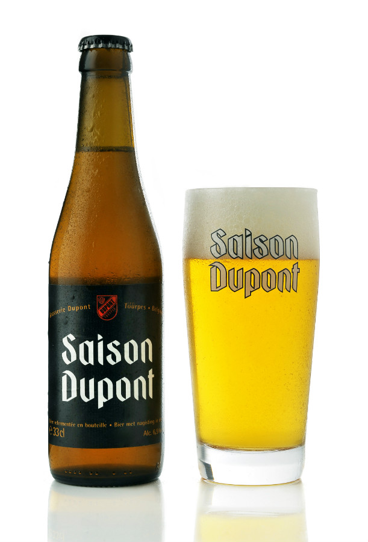

# 종류

크게는 Ale 과 Lager로 나뉘어 집니다. 보통은 Ale로 분류되기도 하는 Lambic 맥주라는 것도 있지만 그렇게 주요한 형태의 맥주는 아니라고 할 수 있다.

## Ale ( 상면발효맥주)

15 ~ 25도의 비교적 높은 온도에서 맥주를 발효시켜서 효모가 표면에 떠올라서 발효시키는 형태의 맥주 (top-fermented)로서 탄산이 적고 색이 진하면서 풍부한 향을 가지고 있는 경우가 많습니다. 그리고 많은 경우 라거 맥주보다 도수가 높은 경우가 많습니다.

### Pale Ale ( 페일 에일)

- 붉은 색과 같은 밝은 색과 함께 과일이나 꽃 향기가 나는 것이 특징이고 일반적인 맥주보다 약간 높은 온도에서 먹는 것이 특징입니다.
- 사실 우리가 알고 있는 Pale 이라는 단어와 다르게 붉은 색과 밝은 색을 띄고 있는데 18세기 이전의 기술 발전의 미비로 이러한 구릿빛 맥주가 다른 맥주에 비해 창백해 보일 정도로 보리를 볶는 기술이 발전하지 않았고 이를 가능하게 해서 Pale Ale 이라는 이름을 가지게 되었습니다.
- 영국의 산업혁명의 태동과 함께 생긴 맥주로서 우리가 아는 유리잔에 거품이 있는 맥주의 원형이라고 합니다.

#### (Engish) Bitter

- 영국의 맥주로 golden 색상에서부터 amber 색상까지 나름 쓴 홉의 맛을 보유하고 있는  3~7% 정도의 맥주를  가리킵니다.

##### Session / Ordinary Bitter

- 4% 이하의 도수는 높지 않지만 홉의 쓴 맛이나 과일의 풍미를 유지한 맥주입니다.

##### Best / Special Bitter

- 4% ~ 4.8% 정도로 위의 Ordinary Bitter를 도수나 쓴 맛 측면에서 강화한 맥주입니다.

##### Extra Special Bitter

- 4.8% 이상의 대중성 보다는 맥주 애호가들을 위해 강화한 버전의 맥주입니다. 이름의 유래는 Fuller's 의 ESB(Extra Special Bitter) 맥주에 유래합니다.

#### IPA (India Pale Ale)

Pale Ale 계열 중에 가장 유명한 맥주입니다.

- 인도에서 영국으로 수출 (영국 동인도회사 - 세계사에 나오는 그 동인도 회사) 하기 만든 형태로서 수에즈 운하가 만들어지기 전 희망봉을 넘어 이동하는 동안에 썩지 않게 하기 위해 도수가 높고 홉의 사용이 많은 편입니다.
- 홉의 높은 함량 때문에 쓴 맛이 강한 것이 특징이며 이 쓴 맛에  맥주 애호가들이 많이 찾는 편입니다.
   
- 이 쪽 맥주 중에서 하나 추천할만한 유명한 맥주로는 Ballast Point 사의 Sculpin 이라는 맥주가 유명합니다. (사실 이 맥주는 미국의 IPA라 밑에서 소개되어야 하나 워낙 훌륭한 베스트셀러 IPA라 여기서 소개합니다.)

#### APA (American Pale Ale)

- 미국의 대기업 양조 업체에 질린 나머지 독창성을 기반으로 새로운 맥주를 창조하겠다는 크래프트 맥주라는 새로운 장르를 개척하게 됩니다. 이에 영국식 Pale Ale을 받아들여 4.5 ~ 6%의 맥주를 만들어 마시기 시작합니다.
- 크게 영국식 Pale Ale 과 큰 차이는 없으나 지리적인 차이로 인해 미국산 홉인 Cascade나 Centennial 등의 홉의 자몽의 시트러스함이 강점인 맥주를 만들게 됩니다. 

- 이 APA에서 IPA처럼 홉의 사용을 늘리면 American India Pale Ale 이라는 맥주가 탄생하기도 합니다.
- 크래프트 양조장의 태동과 함께 한 맥주로 우리나라에 있는 대부분의 크래프트 맥주라고 하면 대표 맥주를 이쪽 Pale Ale 혹은 American IPA 등을 기반에 두고 있습니다.

#### Amber Ale

- ds

#### Bière de Garde

- 프랑스의 Nord-Pas-de-Calais 지역(벨기에와 인접지역인 프랑스의 북동부이자 도버해협의 프랑스 지역)의 맥주로서 겨울에서 봄까지 농사일 하다가 마시도록 담근 맥주입니다. 말 그대로 Farmhouse Ale 이고 우리나라의 막걸리로 생각하면 될 것 같습니다.
- 말 그대로 번역하면 _Beer for keeping_ 이라고 합니다.
- 지역적 특징 때문에 벨기에 맥주와 많은 공통점이 있습니다. 
- Blond, Amber, Brown 세가지 종류로 나뉘며 Blond 에서 Brown 으로 가면 갈수록 색이 짙어지며 맥아의 단 맛이 강해집니다. 도수는 6~8.5% 로 일반적인 맥주보다는 높지만 도수 자체는 막걸리랑 비슷합니다.

#### Blonde

- 벨기에의 Ale 맥주의 가장 기본적인 형태로 금발이라는 단어처럼 매우 밝은 색상을 띄며 쓴 맛은 적으며 맥아로 부터 오는 단맛이나 에스테르로부터 오는 과일스러움이 감도는 맥주이며 도수는 6 ~ 7% 정도 되는 맥주입니다.
- 벨기에의 수도원 맥주의 일원으로 취급 받으며 생각보다 높은 도수에 비해서는 산뜻한 느낌의 맥주입니다.

- 우리나라에서 가장 쉽게 구할 수 있는 맥주는 Abbey Ale 의 한 종류인 Leffe 양조장의 Leffe Blonde 이며 마트 어디가나 쉽게 구할 수 있습니다.

#### Schotch Ale

- Scotland 에서는 기후적인 특성상 곡물 위주의 양조가 발달했고 단맛과 무게감이 지배하는 맥주가 유행했습니다. 그래서 도수는 2.5% ~ 5.5% 정도의 알코올 도수를 가집니다.
- Whisky 의 고장인 Scotland 인 만큼 Whisky Cask 를 다루는 기술을 이에 적용시키는 크래프트 맥주 양조장의 시도도 이 맥주를 시작으로 시작되고 있습니다. 

##### Scotish Wee Heavy

- 강한 맥아적 특성을 강하게 느끼기 위해 7% 이상의 Scotch Ale 을 만든 것을 가리키고 맥아적 성향과 더불어 Peat (피트) 등의 스모키함을 접할 수 있는 맥주입니다.

### Stout / Porter (스타우트 / 포터)

- 스타우트는 로스팅된 보리와 Malt를 즉 검게 태운 보리와 Malt를 사용합니다. 그래서 일반적으로 검은 색을 띄고 있습니다.

- 검게 구운 보리를 사용하여 커피 원두와 쓴 맛이 특징입니다. 그래서 커피와 종종 많은 콜라보를 이루는 편입니다. 그리고 무게감도 높은 편입니다. 그래서 초콜렛과 같은 디저트와 잘 어울리는 편입니다.  

  

- 대표적인 맥주는 기네스 맥주입니다. 주변에서 쉽게 구할 수 있는 맥주입니다. 

- 사실 국내에서 쉽게 구할 수 있는 기네스 맥주는 오리지널 스타우트와는 조금 떨어진 타입이고 캔에 볼이 들어 가 있는데 이것으로 거품을 내서 먹을 수 있도록 하는 것이 좋습니다. 오리지널 스타우트 방식은 기네스 오리지널이라는 방식으로 판매가 됩니다.

- Porter 의 경우 England의 짐꾼 노동자(Porter) 들이 마시는 England 식 이고 Stout의 경우 Ireland  식을 뜻합니다. 사실 경계는 모호한 편입니다. 이에 대해 보통은 Oatmeal, 초콜렛, 커피 등으로 로스팅 된 malt 의 비중이 낮으면 stout 그리고 malt의 비중이 높으면 Porter라고 생각하지만 이는 맥주 애호가들 사이에서도 항상 논쟁거리중 하나입니다.

- 일반적으로 7 ~ 8 % 의 도수를 띄고 있지만 스타우트의 한 종류인 Imperial Stout / Porter 의 경우에는 12도 이상 가는 경우가 있다고 합니다. 

#### Sweet Stout / Milk Stout

- 일반적인 Stout / Porter 의 경우 전체적으로 묵직하고 단 맛과는 거리가 많은 특징을 드러내고 있어서 이를 보완하기 위해 유당성분을 가미해서 초콜렛을 먹는 것 같은 느낌을 주게 되는 맥주로 변하게 되고 무게감이 느껴지는 Stout를 부드럽게 마실 수 있게 변형되어 있습니다.

#### Oatmeal Stout

- Oatmeal (귀리)를 맥아 일부를 대채하여 사용함으로서 적당히 달고 묵직한 느낌도 유지한 그러한 맥주입니다.

#### Russian Imperial Stout

- 말 그대로 제정 러시아의 스타우트입니다. 하지만 러시아가 원산지는 아니고 영국이 원산지입니다.
- 앞에서 설명한 IPA 처럼 제정 러시아에 팔기 위해 도수를 높여서 판매한 맥주이고 이런 전략이 높은 도수의 보드카를 마시던 러시아에 잘 먹혀 들어갔던 모양입니다.
- 약간 Dry 하며 도수를 높이기 위해 보리의 사용을 늘린 특징을 가지고 있습니다. 최소 8% 이상의 도수를 가지는 특징이 있습니다.
  
- 개인적으로 추천하고 싶은 맥주는 Old Rasputin 이라는 스타우트 맥주입니다.

#### Baltic Porter

- 영국의 Porter가 제정 러시아로 넘어간 것 처럼 발트해 연안 국가에 수출되게 되었습니다. 하지만 이들 국가들은 이를 자국방식으로 변화시키게 되고 이를 Baltic Porter 라고 합니다.
- 도수가 7~8% 정도로 높으며 맥아적인 특징을 강하게 드러냅니다. 
- 또한 발트해 연안 국가들은 독일 체코와 같은 Lager 국가의 영향을 많이 받아서 이들 나라에서 생산되는 홉과 효모를 사용하여 하면 발효 (cool-fermented) 시킵니다. 그래서 정확히 구분하면 Lager 맥주이긴 하지만 Porter 라는 이름과 그 기원 때문에 자주 Ale 맥주로 분류됩니다.

### 밀 맥주 (Wheat Beer)

- 50 % 이상의 주 원료가 보리가 아닌 밀로 빚은 맥주를 뜻합니다.
- 의외로 주요 생산지는 맥주를 보리, 홉, 물로만 만들어야 한다는 독일의 바이에른 지방(주도: 믠헨)입니다.
- 크게 독일 방식인 Weissbier(Weizen) 와 벨기에 (혹은 네덜란드) 방식인 Witbier 방식이 유명합니다. 둘 다 어원은 영어로 White + Beer 입니다.
- 에일 맥주 중에서 가장 널리 알려지고 판매되는 편이며 쓴 맛이 적고 거부감이 적은 편이라 맥주 입문자에게 추천 되는 맥주입니다.

  #### Weizen

- 독일식 밀맥주의 경우에 맥주 순수령의 진원지인 바이에른 지방의 맥주여서 맥주 순수령에 의하면 맥주로 인정 받을 수 없어서 전해질 수 없는 맥주이나 바이에른 지방의 지배자의 마음에 들었다는 이유만으로 살아남았습니다. 다른 고대의 맥주와 다르게 상당히 밝은 색으로 가지는 특징이 있습니다.
- 일반적으로 Weizen의 경우 길쭉하고 입구가 넓은 형태의 잔에 마시게 됩니다.

##### Hefeweizen

- Hefe는 독일어로 효모라는 뜻으로 효모가 들어가 있는 밀맥주라고 해석할 수 있습니다. 효모가 들어간 밀 맥주라는 의미로 Weizen 전용 효모를 사용해 양조하고 이를 거르지 않고 마시는 맥주입니다. 보통 독일식 밀맥주라고 하면 이 Hefeweizen 을 가리킵니다.  그래서 이 맥주는 밝은 금색의 탁한 형태의 색을 띕니다.

##### Kristallweizen

- 위에 설명한 hefeweizen에서 효모를 걸러서 마시는 형태의 맥주입니다. 그래서 밀맥주라고 소개하기전에는 일반적인 황금색 맥주와 색깔이 비슷합니다. 맛은 Hefeweizen과 크게 다르지 않습니다.

- 위의 사진이 Edinger 사의 Kristallweizen과 Hefeweizen 입니다.

#### Witbier

- 벨기에의 밀맥주에서 이 사람을 빼놓고는 설명이 되지 않습니다. Pierre Celis (1925-2011) 라는 이 분은 벨기에의 호가든 주의 한 우유장수였는데 거의 명맥이 끊겨 역사책에 기록될 Witbier 를 부활시키고 이를 전 세계적으로 유행시킨 분입니다.

  

- 고향 이름에서 눈치채셨겠지만 이 분이 복원한 맥주로 가장 유명한 맥주가 호가든 입니다. 그는 하던 우유장수를 그만두고 Celis Brewry 라는 곳에서 이를 복원했지만 화재로 인해 부도 위기에 처하자 이를 Interbrew 에 팔게 되고 이쪽에서 만들어진 맥주가 호가든입니다. 

- 이에 실망한 Pierre Celis 는 미국 Austin 에서 다시 맥주를 만들고 Celis White 라는 맥주로 팔리고 있습니다. 얼마전에 돌아가셨지만 이 맥주의 명맥은 이 분의 딸인 Christine Celis 가 잇고 있습니다.  우리나라에서 팔고 있는 호가든보다 이쪽이 더 오리지널 호가든에 가까운 맥주라고 할 수 있습니다.

  

- 호가든으로 대표될 수 있는 Witbier 의 경우 독일의 Weissbier 와의 가장 큰 차이점이 맥주 순수령에서 자유로울 수 있어서 말린 오렌지 껍질이나 코리엔더 씨앗 같은 재료가 들어간다는 점입니다. 

- 전체적인 성향은 크게는 독일식 Weizen과 크게 다르지 않으나 향신료의 첨가 유무로 과일향이나 향신료의 풍미가 느껴진다는 점입니다.

#### Berliner Weisse

- 베를린의 밀맥주라는 뜻의 맥주로 바이에른 지방의 Weizen 과는 다른 스타일의 북부 스타일의 맥주를 탄생시켰습니다. 
- 맥주 효모를 사용하는 대신 젖산균을 사용하여 발효시켜 신맛이 나는 3% 정도의 도수의 맥주로 그대로 마시기보다는 과일 시럽을 첨가하여 마시는 경우가 많습니다. 칵테일과 비슷한 느낌으로 소비되는 느낌입니다.
- 이 맥주의 경우에 베를린 밖에서 생산된 경우에는 이 단어를 사용할 수 없습니다.

### Brown Ale

- //TODO: FILL

### 알트비어 (Altbier)

- 독일 뒤셀도르프 지방을 중심으로 발달된 맥주로서 구리빛의 짙은 색을 띄며 구수하고 묵직한 맛을 띄고 있습니다. 독일어로 하면 Alt 는 Old 라는 뜻으로 
- 상면 발효를 위한 효모를 사용하여 라거와 비슷한 형태로 상대적으로 저온에 숙성시키는 (pre-lagered method)의 방식으로 제조됩니다.
- 상업 맥주로 유명한 것은 디벨스라는 맥주인데 아무래도 이 맥주는 지역 특산품 같은 성향이 강하므로 독일을 방문하면 가보시는게 좋겠죠?

### Kölsch (쾰슈)

- 이름에서 부터 독일 냄새가 풀풀 나는 맥주입니다. 이름에서 알 수 있듯이 쾰른 지방의 명물 맥주입니다.
- 다른 Ale  과는 달리 lager 처럼 맑은 형태의 맥주입니다.
- 상면 발효 맥주이지만 발효는 고온에서 되지만 숙성은 저온에서 숙성됩니다. 그래서 Ale 맥주의 향과 느낌은 물론 라거의 깔끔함과 맑은 색깔을 가지고 있는 맥주입니다.
- 상대적으로 등장 시기는 늦은 편입니다. 1918년 등장해서 2차대전 이후 부터 독일에서 유명해진 맥주입니다.
- 현재 법적으로는 쾰른 시에서 등록된 양조장만이 이 이름만을 쓸 수 있다고 합니다. 독일 쾰른 시에 방문하면 쾰른 대 성당은 물론 맥주도 꼭 마시고 옵시다.
- 쾰른 호프집에서 마시는 쾰슈 맥주의 경우에는 다음과 같은 작은 잔이 원형으로 담긴 크란츠(Kranz) 에 담아서 서빙하는 방식으로 제공되고 있다고 합니다. 잔이 약 200 ml 정도라 잘 모르시는 분들은 크기에 실망하는 경우가 많은 걸로 알고 있습니다.

### Belgian Ale

#### Enkel

- 용어 자체는 Single 을 뜻하는 단어로 벨기에 수도원의 내부적으로 소비되기 위한 용도로 생산되는 맥주입니다.
- 4% ~ 5% 정도의 가벼운 색상을 가지는 맥주로 대중적으로 구하기는 거의 불가능하며 벨기에의 수도원으로 직접 가야 찾을 수 있다고 합니다. 그 곳에서도 Blond 와 같은 Enkel 이라는 용어를 직접 사용하지는 않는다고 합니다.
- 구하기 힘들고 대중에 잘 노출이 되지 않는 특성 때문에 흔히 맥주의 스타일로 구분하지 않는 경우가 많이 있습니다.

#### Dubbel

- 용어 자체는 Double 을 뜻하는 단어로 벨기에 수도원 맥주의 기본적인 형태로 어두운 색의 6% ~ 7.5% 정도의 도수를 가지는 맥주입니다. 
- 맥주 자체는 매우 강한 맥아의 단맛이 느껴지고 검은 과일류(건포도, 건자두, 대추) 등의 풍미가 느껴지며 양조 과정에서 추가하는 카라멜과 갈색 설탕류로 인해 초콜렛과 카라멜적 풍미를 가지는 맥주입니다.
- 시초는 수도원 맥주인 Westmalle 수도원의 Dubbel 맥주로서 이러한 맥주는 수도원 맥주 뿐만 아니라 여러 양조장에서 생산되고 있습니다.

#### Tripel

- 단어 자체의 뜻은 Triple 이라는 뜻으로 Dubbel 의 강화된 형태의 맥주입니다. 역시 수도원에 기원한 맥주입니다.
- 도수는 7.5% ~ 9.5% 정도이고 색상은 Dubbel 에 비해 (아이러니하게) 밝은 형태의 색상을 띕니다. Dubbel 에 비해 무게감은 낮고 상대적으로 꽃과 허브와 같은 특징을 가집니다. 
- 참고로 필자가 가장 좋아하는 스타일의 맥주입니다. 추천 맥주로는 Tripel Karmeliet 이 있습니다. 

#### Quadrupel

- 이름에서 예상 할 수 있듯이 앞의 스타일의 4단계 맥주입니다. 기본적으로는 Dubbel 과 비슷한 느낌의 맥주이지만 도수가 10% ~ 12% 정도이며 매우 묵직하고 쉽게 마실 수는 있는 스타일은 아닙니다.
- Dubbel 보다 매우 강조된 스타일의 맥주라 매우 검붉은 색의 맥주로 처음 보면 흑맥주로 오해하기 쉽습니다.

- 위 맥주는 수도원 맥주의 정수인 Westvleteren 수도원의 Quadrupel 맥주로 오랫동안 맥주 리뷰 사이트에서 랭킹 1위를 달성한 가장 유명한 맥주 중 하나입니다.

#### Saison

- 5% ~ 7% 정도의 밝은 색의 맥주로서 과일과 아로마적인 특성인 느낌이 강한 맥주입니다.
- 벨기에 남부 지역인 Wallonia 지역의 농가에서 농번기에 마시는 3% ~ 3.5% 정도의 맥주로서 농번기를 대비하여 겨울과 봄 사이에 담구어두던 맥주입니다. 그래서 우리나라의 막걸리처럼 가양주(집에서 빚는 술)로서 각 집마다 스타일이 조금씩 달랐다고 합니다.
- 이러한 맥주가 현대에 오면서 앞에서 말한것과 같이 도수가 올라가고 지금의 스타일이 정착된 것입니다.

### Barley Wine

### Old Ale

### Flanders Red Ale

### Flanders Old Bruin

### Gose

- 라이프니츠

// TODO: 가장 강한 맥주 Brewmeister's Snake Venom 67.5%

### Rye Beer

- Roggenbier 는 어쩌면 밀맥주 카테고리가 적당하다고 생각될만큼 바이에른 지방에서 유래했으며 Weizen 에 밀 대신 호밀을 넣어 양조한 맥주입니다. 
- 이 맥주가 미국의 창의적인 microbrewery 들에 의해 영국식의 IPA와 만나 Rye IPA라는 형태로 재창조되고 있습니다. IPA라는 형태에 의해 상당히 홉의 쓴 맛이 강조되는 특징이 있습니다.

- 여기까지 정말 간략한 제가 리뷰하고 싶었던 Ale 맥주 들이였습니다. Ale 맥주는 흔히 보는 맥주가 아닌 것이라 생소할 수 있지만 주변에 흔히 유통되는 맥주의 형태가 아닌 맥주이고 가격대가 저렴하지 않아서 생소할 수 있는 맥주의 형태입니다.

- 종종 맥주에 대해 알아게 되면 Ale 맥주가 우월하다고 주장하는 오류에 쉽게 빠지게 되는 경우가 발생하지만 이는 쉽게 빠질 수 있는 편협한 생각일 뿐입니다. Ale 맥주가 좀 더 오래되고 다양한 스타일이 있는 것 뿐이고 이러한 편협한 주장에 빠지지 않았으면 합니다.

## Lager (하면 발효 맥주)

- 5 ~ 12도의 비교적 낮은 온도에서 맥주를 발효시켜 효모가 바닥에 가라 앉아 발효시키는 형태 (bottom-fermented)의 맥주로서 비교적 대규모 생산하기 좋은 형태이며 일반적으로 황금색에 탄산이 많고 청량감이 특징인 맥주입니다.

- 산업의 발달과 냉장기술의 발달과 함께 저온으로 장시간 보관이 가능한 현대에서 대량 생산이 가능하면서 만들어진 형태입니다. 즉 현대 기술이 만들어 준 하나의 맥주 기술의 발전이라고 할 수 있는 맥주라고 할 수 있습니다.

### 페일 라거 (Pale Lager)

- 가장 일반적인 라거 맥주로서 연한 황금색과 적당한 쌉쌀함, 청량감을 갖는 맥주입니다.
- 대부분의 상업맥주는 이 계열에 속하는 경우가 많습니다.

#### 필스 (Pilsener / Pils / Pilsen)

- 체코에서 개발된 최초의 밝고 투명한 색으로 홉의 쓴 맛이 강한 맥주입니다. Pils 이전의 lager는 거의 대부분이 진한 색상의 맥주였고 Pale (golden) lager 의 원형이라고 합니다. 체코의 플젠(Plzeň) 지방에서 독일 바이에른 지방의 맥주 맛에 자극을 받은 사람들이 1839년 Měšťanský pivovar Plzeň (플제니 지방 시민 양조장) 을 세워서 바이에른 스타일의 맥주를 생산한 것이 필스너 맥주이며 저 양조장은 현재  Pilsner Urquell 양조장입니다.

- 이 Pils 맥주의 원형이자 오리지널인 Pinsner Urquell 맥주는 현재 어느 마트의 수입 맥주 판매대를 가도 쉽게 발견할 수 있습니다.
- 이 맥주의 성공으로 맥주에 대한 자부심이 대단한 플젠과 지리적으로 가까운 독일에서부터 이 맥주를 복제하기 시작하고 이것이 현재의 Pale Lager가 압도적인 시장 점유율을  이룩할 수 있게 되는 원천이 되었습니다.
- 이 맥주를 계기로 독일에도 필스너가 전파되게 되어 크롬바커 같은 독일의 필스너 맥주도 생겨나게 되었습니다.

#### Dortmund Export (엑스포트)

- 체코의 필스너 맥주의 성공에 본 받아 여기저기서 필스너 맥주를 복제하기 시작합니다. 플젠에서 가까운 맥주의 본고장이라 할 수 있는 독일에서부터 시작해서 말이죠. 맨 처음 필스너의 성공에 도르트문트 양조장들이 연합해서 필스너를 복제하여 수출을 위해 만든 맥주를 만들어서 판매합니다.
- 수출용? 이라고 해서 Export 라는 이름이 붙어서 독일 보다는 타 지방에서 더 자주 발견되는 맥주라고 합니다.
- 도르트문트 연합 양조장(DUB) 과 이와 별개로 활동하는 DAB(Dortmund Actien Brewery) 에서 만드는데 DAB이 유명합니다.

- 기본적으로 필스 맥주와 거의 유사하지만 필스 맥주의 쓴 맛을 좀 부드럽게 만든 맥주라고 합니다. 그래서 보통은 Soft Pilsner 라고도 하는 말이 있지만 일단 Pilsner의 영향을 직접적으로 받은 만큼 홉의 쓴 맛을 유지하고 있습니다.

#### Munich Helles(헬레스)

- 마찬가지로 필스너 맥주의 성공에 배 아파 하던 뮌헨 지방 사람들도 뭔가 Golden lager 비슷한 것을 만들었습니다. 뮌헨 지방의 특징인 Malty 한 특성을 감미하여 Golden Lager 를 생산해서 판매하기 시작했습니다. 이로 인해 Pilsner 보다 쓴 맛이 약화된 특징이 있습니다.

- 개인적으로는 쓴 맛이 약화된 덕분에 일반적인 Golden Lager과 큰 차이가 없는 특징을 가졌다고 생각합니다.( 물론 맛 없는 것은 아니지만)

- 독일 뮌헨 지방의 양조장인 뢰벤브로이나 파울라너 같은 Original 이 붙은 lager 맥주는 이 계열의 맥주로 보시면 됩니다.

  

#### Radler (라들러)

- Radler 는 자전거를 타는 사람을 의미하는 말로 Pils나 Helles 와 레모네이드를 1:1로 섞어 갈증난 라이더들을 위한 맥주(….)를 20세기 초 만들었습니다. 그래서 도수는 2~3% 정도이며 갈증 해소용으로 많이 마시는데… 음주 라이딩이 괜찮은건지는 잘 모르겠습니다.

#### America Adjunct Lager (미국식 부가물 맥주)

- 19세기 미국으로 건너간 독일 이민자들이 세운 맥주 개념으로 부드럽고 가볍게 마실 수 있도록 보리와 홉의 비중을 줄이고 쌀과 옥수수 전분과 같은 부가물을 섞어서 빚은 맥주입니다.
- 매스미디어와 마케팅의 발달로 폭발적으로 성장한 맥주이며 전 세계 상업 맥주 시장의 70% 이상은 이 미국식 맥주가 차지하고 있습니다. 마케팅의 발달로 성장한 맥주답게 마케팅 적인 브랜드 이미지 같은 요소가 굉장히 강한 맥주 종류 중 하나입니다.
- 버드 와이저, 밀러, 코로나 등 대부분의 큰 맥주 회사들이 여기에 속해 있으며 우리나라의 대부분의 맥주도 이 계열의 맥주입니다. 사실 맥주의 본 고장 중 하나인 영국에서도 시장의 70% 이상은 이 맥주가 차지할 정도로 대중이 생각하는 맥주의 전형이라고 할 수 있습니다.

#### 드라이 맥주

- 일종의 미국식 부가물 라거의 변종으로 일본에서 처음 개발되어 발전되고 있는 맥주입니다. 일본 정확히는 아사히 맥주를 필두로 가볍고 부드러우며 끝 맛이 깨끗함을 강조하는 맥주입니다. 이를 위해 보리의 함량이 적고 부가물(옥수수 전분이나 쌀)의 비중이 높아진 특징이 있습니다.
- 끝 맛이 깨끗하게 끊어지는 특징을 위해 당 분해 능력이 강한 고 발효 효모를 사용한다고 합니다.
- 당연히 맥주의 맛과 향을 강조하는 맥주 애호가들에게 보리 함량이 줄어들고 맛이 딱 끊기는 맥주의 평가는 좋을 리는 없죠? 개인적으로도 끝 맛이 딱 끊기는 이런 맥주는 맥주가 아닌 시원하고 청량한 음료를 마시는 느낌입니다.
- 일본 및 한국에서 출발한 것과 같이 맥주의 향과 맛이 아니라 음식에 곁들이는 음료의 개념으로는 적절한 맥주라고 할 수 있습니다. 한국에서도 최근에 하이트 맥주사에서 드라이 피니시 d 라는 맥주로 드라이 맥주를 선보이고 있습니다.

- 개인적인 견해로는 치맥 같은 계열에 가장 잘 어울리는 맥주가 아닐까 합니다.

### **다크 라거 (Dark Lager)**

- 하면 발효식으로 만들어진 일반적인 흑맥주로서 일반적으로 적갈색에서 부터 검은 색을 띄고 있습니다.
- 하이네켄 다크, 국산 맥주로서는 스타우트가 있습니다. 그리고 그 외에도 세부 종류의 dark lager 들이 있습니다.

#### Schwarzbier

- 독일의 중부인 튀링겐 지역이나 작센 지역에서 유래한 맥주로서 Schwartz 라는 단어가 검게 그을렸다는 형용사입니다. 
- 일단은 Roasted Malt 가 사용되어서 흑맥주이지만 일반적인 흑맥주의 특징이라고 생각되는 강한 느낌이 아니고 4~5%의 도수를 가진 맥주입니다. 

#### 둥켈 (Dunkel)

- 독일 남부 바이에른 지방에서 만든 흑맥주의 한 방식으로서 Dunkel 은 독일말로 dark 라고 합니다. 일반적인 dark lager와는 달리 흑맥주 답지 않게 malt에 맛에 의해 달콤하고 부드러운 맛을 가지는 동시에 맥아의 로스팅에 의한 쓴 맛이 경감된 맥주입니다.
- Erdinger Dunkel, Paulaner Original Münchner Dunkel이 있습니다.

- 밀 맥주의 고장 답게 Hefeweizen Dunkel (둥켈 방식으로 만든 밀 맥주) 도 Dunkel 이라고 합니다.

#### 라우흐비어(Rauchbier / Smoked Beer)

- 훈제한 소세지 맛이 나는 특이한 맥주입니다. (진짜 납니다)
- 독일 바이에른 주의 밤베르크에서 유래한 맥주입니다.
- Malt를 공기에 건조시키거나 나무에 불을 붙여 간접적으로 건조, 즉 소세지 만드는 방식으로 훈연시켜 만들어진 malt로 만든 맥주로서 맥주에 훈제한 소세지 맛이 납니다(진짜 납니다). 맥주 양조장에서 보리 몰트가 화재로 다 타버려서 망했다고 하는 찰나에 그래도 아까워서 맥주를 빚은 것이 Rauchbier 라는 속설이 있다고 카더라.... 가 있습니다.
- 하지만 일반적으로는 1700년 이전 몰트를 연기와 분리시켜 가마(kiln)에 직접적으로 구워 말리는 기술이 있기 전까지 다 훈제된 malt를 사용했다고 하고 이를 이용해서 맥주를 만들었지만 그 이전 방식을 그대로 이용해서 만드는 맥주를 Rauchbier라고 합니다.

- 일반적으로는 독일에 가야 먹을 수 있는 명물이지만 Samuel Adams 같은 곳에서 나온 경우도 있습니다.

### Oktoberfestbier / Märzen (옥토버페스트 맥주 / 메르첸)

- 맥주와 관련된 이야기를 하면 역시 옥토버페스트는 빼 놓을 수 없는 주제입니다. 뮌헨 지방에서 9월말부터 10월초까지 16일간 열리는 10월의 축제 (October + Festival) 입니다. 이 기간에는 맥주를 양조하기 좋지 않은 더운 여름 기간동안 소비하지 못한 맥주를 소비하기 위한 축제가 필요했는데 이를 위한 축제가 옥토버페스트입니다.
- 옥토버페스트가 열리면 뮌헨의 테레지엔비제(옥토버페스트 광장)에서 약 600만명의 사람이 찾으며 소비되는 맥주의 양이 500만 리터에 달한다고 합니다. 이 때 각 맥주 양조장들은 특별히 알코올 도수가 높은 맥주를 내 놓는데 이것이 Oktoberfestbier / Märzen 입니다. 사실 Oktober는 10월, Märzen 3월이라는 이상한 조합이지만 3월에 양조해서 10월에 소비한다는 의미입니다.
- 사실 이 축제 기간에는 좋은 맥주가 빚어 나오기 좋지 않은 계절로서 축제 전 맥주를 빚을 수 있는 마지막 달인 3월부터 9월까지 서서히 숙성시키는 맥주로서 원래는 흑갈색의 쓰고 풍부한 맛의 맥주라고 합니다. 하지만 요즘에는 차차 밝은 색의 맥주가 나오고 있다고 합니다.
- 현재 옥토버페스트 축제에 제공되는 맥주 회사는 Spaten, Löwenbräu, Augustiner-Bräu, Hofbräu-München, Paulaner and Hacker-Pschorr 6개로 한정되어 제공되며 이 6개의 맥주회사만이 쓸 수 있는 트레이드마크가 되어 있습니다. 
- 옥토버페스트에 가보면 맛 볼 수 있는 한정판 맥주라고 할 수 있습니다.

### 복(Bock)

- 독일에서 추운 겨울동안 발효시켜 긴 발효 시간과 강한 맛과 높은 도수를 자랑하는 strong lager 맥주입니다.
- 일반적으로는 진한 색을 띄고 있고 있습니다. 
- 여러가지 bock 의 계열이 존재하지만 원래 bock 보다 연한 색깔인 helles bock 이나 알콜도수가 상대적으로 높은 dopplebock 가 존재합니다. 또한 이보다 더 도수가 높은 Eisbock (추운 기간에 얼음이 얼 정도로 긴 기간동안 발효시킨) 이 있어서 도수가 상대적으로 높습니다.
- 때로는 Strong 이라는 의미로도 쓰여서 Weissbock 같은 이름의 **강한** 이라는 수식어로 사용될 수도 있습니다.

### Kellerbier

- 말 그대로 번역하자면 지하실(Cellar) 맥주입니다. 보통은 상면발효되거나 하면발효될 수 있으나 보통은 라거로 취급됩니다.
- 이 맥주의 특징으로는 보통의 맥주는 효모를 필터링하거나 살균하는 과정을 거치지만 이런 과정이 들어가지 않아서 Unfiltered, Unpasteurised 라는 특징을 가져서 본고장인 독일 이외에서는 구하기 힘듭니다.

## Lambic (람빅 맥주)

- Lambic 맥주의 경우에는 앞에서 언급한 Ale이나 Lager와 달리 인공적인 효모를 사용하지 않고 공기중의 박테리아에 노출시켜 숙성시키는 맥주입니다. (영어로 표현하면 fermented spontaneously 라고 씁니다.)
- 다른 맥주에 비해 정말 숙성 기간이 길고 (정말 자연적으로 썩히...) 딱히 효모를 사용하지 않고 공기중의 박테리아를 사용하고 거의 2-3년의 숙성 기간을 거치기도 합니다.
- 발효의 제어가 쉽지 않아서 정말 보기 힘든 형태의 맥주이며 주로 벨기에 Brussel 지방에서 생산되고 있습니다.
- 전체적으로 신 맛의 형태를 띄고 있습니다. 종류에 따라 다르지만 Gueze 의 경우 4~6% 그리고 Fruit Lambic의 경우 3% 이하인 경우가 많습니다.
- 국내에서는 린데만스 양조장이나 St. Louise 양조장에서 생산된 맥주가 판매중이며 최근에 Boon 양조장에서 생산된 맥주가 들어오고 있습니다. 그리고 유명한 양조장으로 브뤼셀 시내에 있는 칸티용 양조장이 있습니다.

### Unblended Lambic 

- 정말 자연적인 상태에서 생산된 Lambic (약 60~70%의 맥아와 30~40%의 밀으로 생산된) 을 그대로 따라줍니다. 그래서 양조장에 직접 가야 먹을 수 있는 편이며 칸티용 양조장 같은 곳에나 가야 먹을 수 있습니다. 별도로 가공하지 않고 2차적으로 숙성시키지 않으므로 탄산감은 거의 없습니다.

### Gueze

- 일반적으로 Lambic 은 2~3년 숙성시킨 Lambic과 1년 정도 숙성된 Lambic 2가지 혹은 3가지를 병입한 상태에서 2차 발효를 시킵니다. 이렇게 함으로서 1년 숙성된 Lambic 에 남아 있는 당의 숙성을 통해 탄산을 발생시켜 발포성을 발생시키고 일반적으로 Lambic 은 이러한 형태로 제공됩니다.
- 병입 과정에서 보통 샴페인처럼 코르크 마개로 막아두는 느낌이고 산미가 느껴지는터라 와인과 같은 느낌이 듭니다.

### Faro

- Gueze 로 2차 병입 숙성시킬 때 설탕이나 카라멜등을 섞어 풍미를 더한 맥주입니다.

### Kriek

- Gueze 로 2차 병입 숙성시킬 때 신 체리를 넣어 풍미를 더한 맥주입니다. 뒤에 설명할 Fruit Lambic의 가장 기초적인 형태이며 기본적이 형태의 Lambic과 잘 어울리는 편이라 가장 유명한 형태의 과일 람빅입니다.

### Fruit Lambic

- Gueze 로 2차 병입 숙성시킬 때 다양한 과일을 넣어 풍미를 더한 맥주입니다. 과일에 따라 Raspberry (framboise), Peach (pêche), Blackcurrant(Cassis) 같은 형태로 주로 제조됩니다.

# Related Information

## Terms

### ABV

- **A**lcohol **B**y **V**olume 의 약자로서 흔히 몇도 맥주 할 때 그 숫자를 나타냅니다.
- 섭씨 20°C 에서 100ml의 맥주에서 존재하는 순수한 에탄올의 ml 수치를 나타냅니다.
- 체코와 중국 이외에는 (간혹 독일에서도) 맥주 도수를 나타낼 때 거의 ABV를 사용하는 편이고 이 두 국가에서는 ABV 대신 Plato(˚) 라는 수치를 사용한다고 합니다. 맥주 만들기 전에 맥아의 당 함량을 나타내는 수치로 대략 2.4 정도를 나눠주면 된다고 합니다.

### IBU 

- 맥주의 쓴 맛을 나타내는 단위로서 1L의 맥주에 1mg의 이성질화 된 (isomerized) alpha acid (맥주의 쓴 맛의 근원인 홉의 쓴 맛) 를 나타냅니다.

- 일반적으로 쓴 맛이 거의 없는 Pale Lager 나 Weizen 의 경우 10 혹은 그 이하이고 쓴 맛이 특징인 IPA 60 이상의 수치를 가지고 있습니다.

# Ingredient 

### Malt

### Hop

### Yeast

## 맥주 순수령 (Reinheitsgebot)

- **German Purity Law**
- Babaria 바이에른 주의 공작이 1516년  위해 보리, 맥아, 홉 이외에 맥주 재료의 사용을 금지한 법률입니다.
- 밀과 호밀과 같은 식량의 확보 및 검증되지 않은 야생허브의 사용에 따른 부작용을 막기 위해 제정되었습니다.
- 이 법은 남독일로 대표되는 바이에른 주에만 유효한 법률이였지만 통일 독일에 바이에른 공국이 참여하는 조건으로 전 독일에 1871년 전 독일 제국에 공표되게 됩니다. (이 때의 수상인 비스마르크의 동의도 있었다고 생각됩니다)
- 그 이후 1993년에 개정된 법률에 의해 하면 발효맥주는 여전히 보리, 맥아, 홉, 효모(효모의 발견은 현미경의 발명 이후인 17세기 이후이므로) 만 사용할 수 있으며 상면 발효맥주는 추가적으로 사탕무나 수크로스 등의 재료가 사용될 수 있게 바뀌었지만 여전히 독일인에게 맥주란 4가지 재료로만 만드는 술로 인식되고 있습니다.

## 씨서론 (Cicerone)

Cicerone 은 영어로 관광 안내원이라는 영단어로서 와인에 소믈리에가 있다면 맥주에는 씨서론이 있습니다.

이 씨서론 프로그램은 미국이 2007년 부터 맥주를 마시는 사람에게 가장 최상의 질을 제공하기 위한 프로그램으로 시작했으며

크게 3 단계로 나뉩니다.

- Certified Beer Server
- Certified Cicerone®
- Master Cicerone®

맥주 장비나 세척 방법 그리고 맥아와 홉의 이해 그리고 같이 먹으면 좋은 음식들 처럼 맥주를 만드는 방법이 아닌 최상의 질과 맛을 제공하기 위한 자격 과정이라고 할 수 있습니다.

1단계인 Certified Beer Server 는 상대적으로 취득하기 쉽지만 위로 갈 수록 취득하기가 어렵다고 합니다.

현재 Master Cicerone 은 전 세계에 7명이라고 하니 얼마나 취득하기 어려운 지 알 수 있을 듯 합니다.

[https://cicerone.org/](https://cicerone.org/)

최근 OB 맥주도 이 관련 프로그램을 2013년 하반기 부터 운영을 한다고 합니다. (어이?)

## 트라피스트 (Trappist) Ale 

홈페이지 : **[http://www.trappist.be/en](http://www.trappist.be/en)**

- 원래 중세 수도원에서는 단식 도중 영양보충이나 손님 접대 그리고 정신 수양 용도로 맥주를 빚고 있었다고 합니다. 이러한 수도원의 맥주를 기반으로 상업화 한 맥주가 Leffe, 파울라너 등 여러가지가 있을 정도로 수도원 맥주는 그 수준이 높습니다.

- 이러한 맥주 중 예전 방식을 고집하며 상업성과 전혀 무관한 Ale 맥주만이 ITA (The International Trappist Association) 의 인정을 받아 

  

  다음과 같은 로고를 붙인 맥주로 인정 받을 수 있습니다. 이러한 인정을 받은 수도원은 단 8 곳 (벨기에 6, 네덜란드 1, 오스트리아 1) 밖에 없습니다. 최근 미국 네덜란드 이탈리아 3곳이 늘어나 총 11곳의 수도원이 Trappist 맥주를 생산하고 있습니다.

  - **Orval** - Brasserie d'Orval  (Belgium)
  - **Westmalle** - Brouwerij der Trappisten van Westmalle (Belgium)
  - **Chimay** - Bières de Chimay (Belgium)
  - **Rochefort** - Brasserie de Rochefort  (Belgium)
  - **Westvleteren** - Brouwerij Westvleteren/St Sixtus (Belgium)
  - **Achel** - Brouwerij der Sint-Benedictusabdij de Achelse Kluis (Belgium)
  - **La Trappe** - Brouwerij de Koningshoeven (Netherlands)
  - **Engelszell** - Stift Engelszell (Austria)
  - **Spancer** - St. Joseph’s Abbey in Spencer (Massachusetts, United States)
  - **Zundert** - Brouwerij Abdij Maria Toevlucht (Netherlands) 
  - **Tre Fontane** - Tre Fontane Abbey (Italy)
    http://www.trappist.be/en/pages/trappist-beers

  그 외 **Mont des Cats** 라는 맥주가 있는데 이는 Trappist 의 조건에 충족하지만 2차대전 이후 수도원을 복구하지 못해서 Chimay 수도원에 대리양조하고 있어서 Trappist 인증을 받지 못한 상태입니다.

  정말 수도원에서 빚는 맥주입니다.

- 여기에 인증 받은 Trappist ale 의 경우 엄격한 조건에 의해 추가된 만큼 상당히 맥주의 질적인 측면에서 우수하며 맥주 랭킹 상에서 거의 대부분이 상위권이 랭크 되어 있습니다.
- [http://www.ratebeer.com/beer/top-50/](http://www.ratebeer.com/beer/top-50/) 에 보면 항상 1위를 빼 먹지 않는 Westvleteren Abbey 의 XII (10.2%) 라는 맥주가 가장 유명하다고 할 수 있습니다. 이 맥주의 경우 국내에서 구하기는 매우 어려우며 이베이 등지에서 병이랑 포장지를 판매할 정도로 레어 품목입니다.

## Abbey Ale

- 수도원 맥주에 그 기원을 가지고 있지만 그 맥주 레시피가 상업화 되어 생산되거나 양조시설이 수도원 밖을 벗어나거나 하는 경우에 이를 Abbey Ale 로 분류합니다. 앞서 설명한 Trappist Ale 과 엄청난 질적 차이가 있는 것은 아니지만 아무래도 접근성이나 상업화에 의한 질적 하락 등을 우려하여 Trappist 보다는 한수 아래로 평가받는 편입니다.

# References

[http://fatpig.tistory.com](http://fatpig.tistory.com) 살찐 돼지의 맥주 광장이라는 블로그인데 엄청난 DB를 보유하고 있습니다.
